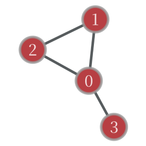

# graph-tool を使ったネットワーク分析プログラム

## graph-tool とは？
[ネットワーク科学](https://w.wiki/6qzk)の研究者 Dr. Peixoto が開発した Python のモジュール。<br>
内部は C++ で実装されており、OpenMP を用いて並列処理を行うこともできるため、<br>
よく知られたネットワーク分析ツールである NetworkX よりも高速に動作する。<br>
公式HP: https://graph-tool.skewed.de/

## 導入方法
pip コマンドでインストールはできない。<br>
Ubuntu や Arch などのよく使われる Linux ディストリビューションでは、<br>
パッケージマネージャを用いたインストールが可能。<br>
例）Debian 系
```
# apt -y install python3-graph-tool
```

## 基本の処理
```python
import graph_tool.all as gt

# ネットワークを表すGraphオブジェクトのインスタンス(無向)を生成
g = gt.Graph(directed = False)

# .gt形式(Graphオブジェクトをバイナリファイルにしたもの)からネットワークデータを読み込む
g = gt.load_graph("hoge.gt")

# ネットワークデータのリポジトリ(https://networks.skewed.de/)から読み込む
g = gt.collection.ns["karate/77"]

# .gt形式ファイルにネットワークデータを書き込む
g.save("foobaa.gt")

# ノード, リンクを追加
v0 = g.add_vertex()
v1 = g.add_vertex()
e0 = g.add_edge(v0, v1)

# ノード, リンクの削除
g.remove_vertex(v0)
g.remove_edge(e0)

# ノード, リンクの総数取得
N = g.num_vertices()
M = g.num_edges()

# ノード, リンクの走査(ノードのインデックスは0から始まる点に注意)
for v in g.vertices():
    print(f"vertex: {int(v)}")

for e in g.edges():
    print(f"edge: {int(e.source())} - {int(e.target())}")

# ネットワークを描画(graph-toolの強みの1つ)
gt.graph_draw(g)
```
さらに詳しく知りたい人向け：
* [公式ドキュメント](https://graph-tool.skewed.de/static/docs/stable/)
* [Pythonと複雑ネットワーク分析](https://www.kindaikagaku.co.jp/book_list/detail/9784764906020/) 1章

## リポジトリ内のファイルについて
## gt_convert.py
テキスト形式のネットワークデータを Graph オブジェクトに変換し、ファイルに保存するプログラム<br>
出力される .gt 形式のファイルはバイナリファイル。
```
$ python3 gt_convert.py example(拡張子不要)
```
## example.txt
```
0 1
0 2
0 3
0 3
1 2
2 2
4 5
```
テキスト形式のネットワークデータのよくあるフォーマット。<br>
ただし、ノード番号は 1 から始まっていることが多い。<br>
`a b` と書かれていたら、a というノードと b というノードの間にリンクが存在する。<br>
今回は無向ネットワークを想定。<br>
`gt.graph_draw(g, vertex_text = g.vertex_index)` で描画すると次のような図が得られる。<br>

## network_check.py
与えたネットワークデータ(.gt 形式)が分析に適した形であるかを確かめるプログラム。<br>
最大連結成分の抽出、多重リンクと自己ループの除去を行う。
```
$ python3 network_check.py example.gt
```
example.txt のネットワークの場合、<br>
次のようなネットワークデータ(example-processed.gt)が出力される。<br>

## indicator.py
ネットワークの各種指標を計算するプログラム。<br>
network_check.py で加工済みのデータを与えることを想定。
```
$ python3 indicator.py example-processed.gt 11(任意)
```
| 記号 | 意味 |
| --- | --- |
| N | ノード数 |
| M | 総リンク数 |
| \<k\> | 平均次数(各ノードがもつリンクの本数を次数という) |
| k_min | 最小次数 |
| k_max | 最大次数 |
| \<L\> | 平均経路長(全ノード間の最短経路長の平均) |
| D | 直径(最短経路長の最大値) |

あわせて次数分布 P(k) をプロットする。<br>
P(k) は全ノード数 N に対する次数が k であるノードの数の割合を表す。
第2引数で軸のスケール(線形/対数)の切り替えが可能。

なお、ネットワークが連結でない場合、D と \<L\> は到達可能なノードのペアのみで計算する<br>
(警告が表示されるので、先に network_check.py を実行することを推奨)
